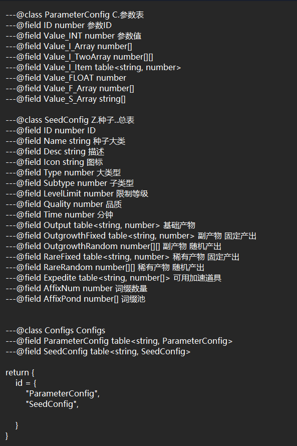

# CsvJsonParser
The json export from csv convert

## Technical details
* .NetCore 6.0 runtime.
* XXXX_RoleAttr.csv split comment and json file name.
* Support type:
1. STRING[] -> string array split by `|`.  
eg: `(text|text|text|text|text)`
2. INT[] -> int array split by `|`.  
eg: `(1|2|3|4|5)`
3. DOUBLE[] -> double array split by `|`.  
eg: `(1.0|2.0|3.0|4.0|5.0)`
4. FLOAT[] -> float array split by `|`.  
eg: `(1.0|2.0|3.0|4.0|5.0)`
5. BOOL[] -> boolean array split by `|`.  
eg: `(true|false|true|true|false)`
6. STRING[][] -> two-dimensional string array split by `|` and inside by `~`.  
eg: `(a1~a2~a3|b1~b2|c1~c2~c3|d1|e1~e2)`
7. INT[][] -> two-dimensional int array split by `|` and inside by `~`.  
eg: `(1~11~111|2~22|3~33|4~33|5~99)`
8. DOUBLE[][] -> two-dimensional double array split by `|` and inside by `~`.  
eg: `(1.0~9.2|2.0|3.0~2.3~4.5|4.0|5.0)`
9. FLOAT[][] -> two-dimensional float array split by `|` and inside by `~`.  
eg: `(1.0~9.2|2.0|3.0~2.3~4.5|4.0|5.0)`
10. BOOL[][] -> two-dimensional boolean array split by `|` and inside by `~`.  
eg: `(true~false|false~false|true~true|true|false)`
11. STRING<> -> string value dictionaries split by `|` and key split by `=`.  
eg: `(k1=v|k2=v2|k3=aaa|k4=world|k5=zzz)`
12. INT<> -> int value dictionaries split by `|` and key split by `=`.  
eg: `(k1=1|k2=22|k3=333|k4=444|k5=555)`
13. DOUBLE<> -> double value dictionaries split by `|` and key split by `=`.  
eg: `(k1=1.1|k2=22.33|k3=333.44|k4=444.55|k5=555.777)`
14. FLOAT<> -> float value dictionaries split by `|` and key split by `=`.  
eg: `(k1=1.1|k2=22.33|k3=333.44|k4=444.55|k5=555.777)`
15. BOOL<> -> boolean value dictionaries split by `|` and key split by `=`.  
eg: `(k1=true|k2=false|k3=true|k4=false|k5=true)`
16. STRING<[]> -> string array value dictionaries split by `|` and key split by `=`.  
eg: `(k1=aa~bb~cc|k2=v2~ass|k3=aaa~2333|k4=world|k5=zzz~aazzz)`
17. INT<[]> -> int array value dictionaries split by `|` and key split by `=`.  
eg: `(k1=11~22~33|k2=44~55|k3=55~666|k4=111|k5=3333~22)`
18. DOUBLE<[]> -> double array value dictionaries split by `|` and key split by `=`.  
eg: `(k1=11.22~22.55~33.25|k2=44.12~55.42|k3=55.1~666.3|k4=111.122|k5=3333.2~22.33)`
19. FLOAT<[]> -> float array value dictionaries split by `|` and key split by `=`.  
eg: `(k1=11.22~22.55~33.25|k2=44.12~55.42|k3=55.1~666.3|k4=111.122|k5=3333.2~22.33)`
20. BOOL<[]> -> boolean array value dictionaries split by `|` and key split by `=`.  
eg: `(k1=true~false|k2=false|k3=true~true|k4=false|k5=true)`
* Emmylua description generator.

